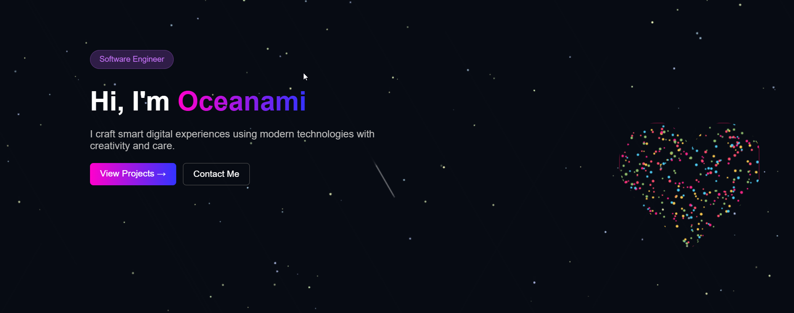

<div align="center">

# 🌌 Oceanami's Portfolio 🌌

### A visually stunning, modern portfolio website built with HTML, CSS, and JavaScript.

[](https://portfolio-drab-eta-20.vercel.app/)

</div>

<p align="center">
  
</p>

---

## 👨‍💻 About Me

I'm **Đặng Tuấn Hùng (Oceanami)**, a passionate developer from Vietnam 🇻🇳. I love creating beautiful and interactive web experiences.

### 🤝 Connect with Me

<p align="left">
  <a href="https://github.com/Ocennami" target="_blank">
    
  </a>
  <a href="https://www.linkedin.com/in/hung-dang-tuan-9a618737a/" target="_blank">
    
  </a>
  <a href="https://www.facebook.com/anghung.358819/" target="_blank">
    
  </a>
  <a href="mailto:dangtuanhung2354@gmail.com" target="_blank">
    
  </a>
</p>

---

## 🚀 Features

- **✨ Animated Background:** Starfield and gradient effects for a cosmic feel.
- **📱 Responsive Design:** Works perfectly on desktop and mobile.
- **🛠️ Skills Showcase:** Colorful skill badges.
- **🖼️ Projects Gallery:** Modern cards with live demo and code links.
- **📫 Contact Form:** Easy way for visitors to reach out.
- **⏳ Preloader Animation:** Custom loader for a professional touch.

---

## 🛠️ Languages and Tools

<p align="left">
  
  
  
  
  
  
  
</p>

---

## 📂 Project Structure

```
Portfolio/
├── index.html
├── styles.css
├── script.js
├── fonts/
│   └── vni-brush.ttf
├── music/
│   ├── *.mp3
├── picture/
│   ├── *.jpg
│   └── *.png
└── README.md
```

---

## 🚀 Getting Started

To get a local copy up and running, follow these simple steps.

### Prerequisites

You just need a modern web browser.

### Installation

1.  Clone the repo
    ```sh
    git clone https://github.com/Ocennami/Portfolio.git
    ```
2.  Open `index.html` in your browser.

---

## 📜 License

Distributed under the MIT License. See `LICENSE` for more information.

---

<p align="center">
  ⭐️ If you like this project, please give it a star on GitHub! ⭐️
</p>
